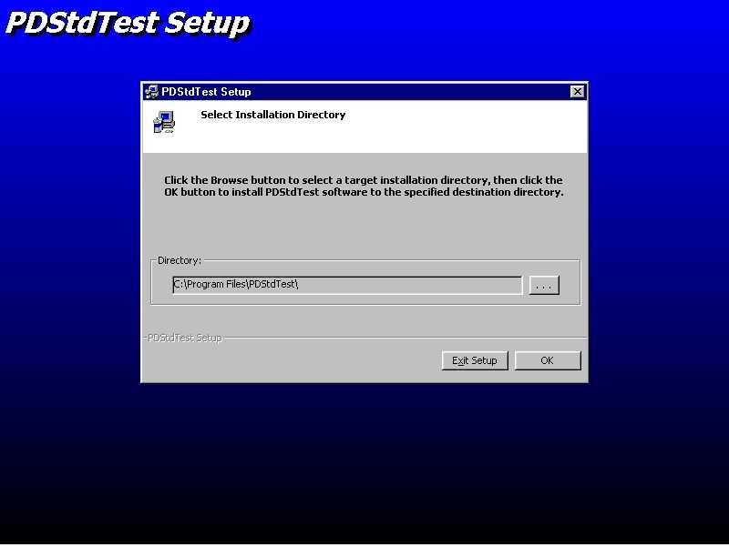



## ProSetup \- Try again LOL\!\!\!  VB6 Setup replacement

### Description

OK, lots of people had problems. So here is the whole nine yards. I don't really know what is up. Just unzip this one and compile it as is.

ProSetup is a seamless replacement for the standard Setup1.exe program that comes with the VB6 P&D Wizard and Setup Toolkit. The current setup has a look and feel of a 4 yo with crayons and fat pencils. ;-)

The forms have been redesigned to give a more professional look. In addition to replacing the existing forms with a more polished dialog style appearance, several other items in the standard Setup1.EXE have been repaired. Specifically:

The file copy form of the existing Setup1.EXE program often just flashes briefly on the screen when only a few files are transferred. There is now a delay on the file copy form, so that the form is displayed for a reasonable time period when the number of files transferred is small.

Similarly, the message dialog of the existing Setup1.EXE program often just flashes briefly on the screen. There is now an adequate delay on the message dialog to allow the message to be read.

ProSetup uses the existing P&D code in it's entirety with no modifications to the setup internals. It works in an identical manner as the commercial setup program. No new bugs should appear by the use of the modified Setup1.exe file. Any existing bugs in the P&D program will still be present. There are a couple of additions and strings modified in the resource file, but these do not affect the program execution. The resource file may need to modified only by those creating international or non-english based setups.

To use the setup program:

Compile the project, and replace the old Setup1.exe with the new version.

To configure a development machine to automatically include the new Setup1.exe program as part of the standard deployment package, simply rename the existing Setup1.exe file to Setup1old.exe, then copy the the new compiled executable as Setup1.EXE in the following directory:

..\Microsoft Visual Studio\VB98\Wizards\PDWizard

Subsequent packages created with the P&D Wizard will now use the new setup program automatically.

Please feel free to contact me concerning any problems, or questions.
 
### More Info
 

             |
---                |---
**Submitted On**   |2002-07-09 11:16:32
**By**             |[Robert Graham](https://github.com/Planet-Source-Code/PSCIndex/blob/master/ByAuthor/robert-graham.md)
**Level**          |Intermediate
**User Rating**    |4.5 (18 globes from 4 users)
**Compatibility**  |VB 6\.0
**Category**       |[Complete Applications](https://github.com/Planet-Source-Code/PSCIndex/blob/master/ByCategory/complete-applications__1-27.md)
**World**          |[Visual Basic](https://github.com/Planet-Source-Code/PSCIndex/blob/master/ByWorld/visual-basic.md)
**Archive File**   |[ProSetup\_\-103947792002\.zip](https://github.com/Planet-Source-Code/robert-graham-prosetup-try-again-lol-vb6-setup-replacement__1-36735/archive/master.zip)

